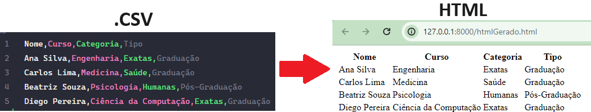

# Conversor com Node JS

Este projeto é um conversor de formatos utilizando Node JS.

<div align="center">
  
</div>

## Sumário

- [Tecnologias Utilizadas](#tecnologias-utilizadas)
- [Status](#status)
- [Descrição](#descrição)
- [Funcionalidades](#funcionalidades)
- [Explicação](#explicação)
- [Como Usar](#como-usar)
- [Autor](#autor)

## Tecnologias Utilizadas

<div style="display: flex; flex-direction: row;">
  <div style="margin-right: 20px; display: flex; justify-content: flex-start;">
    
  </div>
  <div style="margin-right: 20px; display: flex; justify-content: flex-start;">
    
  </div>
</div>

## Status


<!-- -->

## Descrição

Este projeto possui um arquivo ReaderWriter responsavel pela leitura e escrita dos tipos de dados, ou seja, a conversão de um tipos e um arquivo App.js responsavél pelo gerenciamento dessas conversões.

## Funcionalidades

Com essa aplicação você consegue fazer as seguintes conversoes:

`1` .CSV => HTML

`2` .CSV => PDF

`3` .JSON => HTML

`4` .JSON => PDF

## Explicação

O arquivo ReaderWriter é composto por diversas classes cada uma com uma função especifica, essas são exportadas e utilizadas no App.js

#### Exemplo de bloco de código

No exemplo a baixo usamos a classe Reader para ler arquivos de forma assíncrona e lidar com erros.
Isso facilita a leitura de arquivos sem precisar usar callbacks, permitindo o uso de async/await para lidar com operações assíncronas.

```javascript
class Reader {
  constructor() {
    this.reader = util.promisify(fs.readFile);
  }

  async readFile(filePath) {
    try {
      const data = await this.reader(filePath, "utf8");
      return data;
    } catch (error) {
      console.error(`Error reading file from path: ${filePath}`, error);
      return null;
    }
  }
}
```

## Como Usar

`1` git clone "linkDoRepositorio"

`2` npm init

`3` npm install html-pdf –-save

## Autor

Desenvolvido por Diego Franco.
